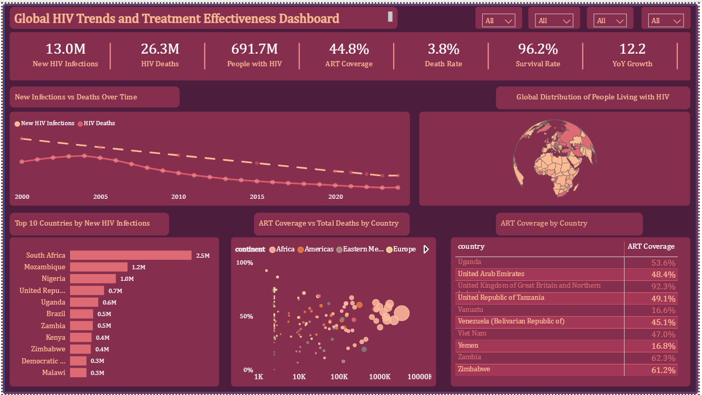

# Global HIV Trends and Treatment Effectiveness Analysis

📊 **Tool:** Power BI | **Domain:** Healthcare / Public Health | **Data:** WHO official data, 2000–2024

## Project Overview

Over the past three decades, the World Health Organisation (WHO) has invested heavily in combating HIV through prevention programs, awareness campaigns, and Antiretroviral Therapy (ART). While global reports suggest mortality is declining, questions remain about how effective and sustainable these interventions really are — especially in regions with limited healthcare infrastructure.

This project evaluates:
- Whether HIV infections are truly declining
- Whether increased treatment access is reducing mortality
- How the overall burden of HIV is evolving globally

## Business Questions Answered

- How many new HIV infections are occurring over time?
- What is the total number of HIV-related deaths globally?
- How many people are currently living with HIV?
- What is the overall level of ART treatment coverage across countries?
- What is the mortality and survival rate of the population?
- How does the trend of infections compare with deaths?
- Which regions are most affected by HIV?
- Which countries have the best/worst treatment access?
- Does higher ART coverage correlate with lower mortality?
- Which countries are most at risk due to poor treatment access?

## Data

- **Source:** WHO official data (150 countries, 2000–2024, recorded every 5 years pre-2019 then annually)
- **Original shape:** Long-format table — `indicator | location_code | continent | country | year | value`
- **Indicators tracked:** New Infections, HIV Deaths, People Living with HIV, ART Coverage (%)

## Data Modeling — Star Schema

Designed a clean star schema with 1 fact table and 3 dimension tables:

| Table | Grain / Columns |
|---|---|
| **Fact_HIV** | country_ID, year_ID, Indicator_ID, value (9,763 rows) |
| **Dim_Geography** | country_ID, country, location_code, continent (150 rows) |
| **Dim_Date** | year_ID, year (25 rows) |
| **Dim_Indicator** | Indicator_ID, indicator (4 rows) |

All relationships verified as 1-to-many, single cross-filter direction, dimension → fact.

*(Insert model diagram screenshot here)*

## Key DAX Measures

```DAX
Total_Deaths = CALCULATE(SUM(Fact_HIV[value]), Indicator_Dim[indicator] = "HIV deaths")

Total_PLHIV = CALCULATE(SUM(Fact_HIV[value]), Indicator_Dim[indicator] = "People living with HIV")

Death_Rate = DIVIDE([Total_Deaths], [Total_PLWH])

Survival_Rate = 1 - [Deaths_Rate]

Deaths_per_1000_Infections = DIVIDE([Total_Deaths], [Total_New_Infections], 0) * 1000

YoY_Growth (2019–2024 only) = DIVIDE([Total_New_Infections] - [New_Infections_PY], [New_Infections_PY])
```

Full KPI list: New HIV Infections, HIV Deaths, Total PLWH, Survival Rate (%), Death Rate (%), ART Coverage, YoY Growth.

## Dashboard


*(Replace this with your actual screenshot file once uploaded to the repo)*

**Layout:**
- KPI strip: headline totals and rates
- Trend line: New Infections vs Deaths over time
- Map: Global distribution of People Living with HIV
- Bar chart: Top 10 countries by New HIV Infections
- Scatter plot: ART Coverage vs Total Deaths by country (correlation view, colored by continent)
- Matrix: ART Coverage by country
- Slicers: Year, Continent, Country, Indicator

## Key Insights

- **Global new infections and deaths have both declined steadily since 2000** (13.0M total new infections recorded vs 26.3M total deaths across the full period), suggesting prevention and treatment efforts have had a measurable long-term impact.
- **691,7M is the cumulative People Living with HIV figure across the dataset**, underscoring that despite falling new infections, the standing burden on healthcare systems remains very large.
- **Average ART coverage sits at 44.82% globally** — meaning a large share of HIV-positive individuals, on average, may still lack consistent treatment access, even as overall mortality falls.
- **Death rate (3.81%) vs Survival rate (96.19%)** shows that, in aggregate, the large majority of people living with HIV survive year to year — but this masks wide country-level variation visible in the scatter plot, where several countries combine low ART coverage with comparatively higher death tolls.
- **South Africa, Mozambique, and Nigeria lead in absolute new infections**, reinforcing that the burden of HIV remains heavily concentrated in Sub-Saharan Africa, consistent with WHO regional reporting.
- **ART coverage varies enormously by country** — e.g. United Kingdom (92%) vs Vanuatu/Yemen (under 17%) — highlighting stark treatment-access inequality rather than a uniform global treatment story.

## Recommendations

1. **Prioritise ART coverage expansion in low-coverage, high-burden countries** — countries combining high new-infection counts with low ART coverage should be flagged as urgent intervention targets.
2. **Use the country-level ART coverage matrix to set differentiated funding targets**, rather than applying a uniform global ART rollout strategy, coverage gaps are highly country-specific, not evenly distributed.
3. **Continue monitoring death rate alongside survival rate**, not in isolation, a high survival rate at the global level can still hide regional crises, so dashboards used for policy decisions should always be paired with country / continent level slicing.
4. **Strengthen annual data reporting consistency** — since reporting frequency improved markedly after 2019, maintaining this going forward will improve trend and YoY analysis quality for future policy decisions.
5. **Treat PLHIV (691.7M) as the core "disease burden" KPI** for long-term healthcare infrastructure planning, since it reflects the standing population requiring ongoing care, distinct from new infections or deaths, which reflect yearly flow rather than total system load.

## Tools Used

- Power BI (data modeling, DAX, visualisation)
- Power Query (ETL / data cleaning)

## Author

Abiola Ayeni— Health Tech | Data Analyst | [GitHub](https://github.com/Abiola-alytics)

